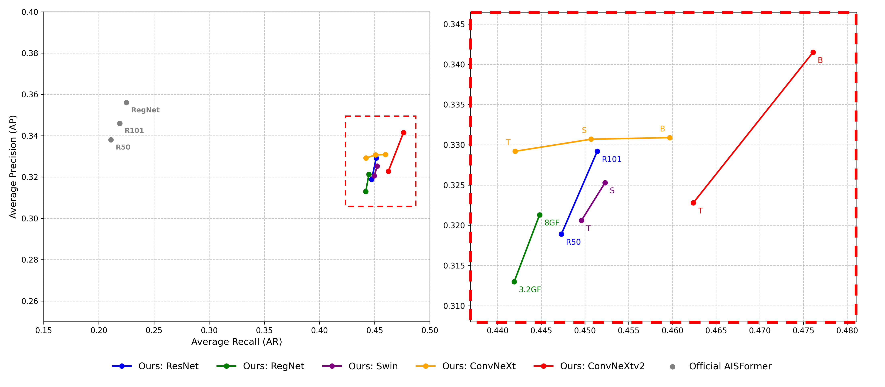

# AISFormer-Pytorch

[Official GitHub (UARK-AICV/AISFormer)](https://github.com/UARK-AICV/AISFormer) | [Paper (arXiv:2210.06323)](https://arxiv.org/abs/2210.06323)

## Project Background and Motivation

This project is an independently developed, pure PyTorch implementation based on the Amodal Instance Segmentation (AIS) architecture proposed by the [UARK-AICV/AISFormer](https://github.com/UARK-AICV/AISFormer) team.

The open-source environment provided by the original authors is built on a customized and modified Detectron2 framework. However, this customized environment often faces forward compatibility challenges when deployed on modern server environments, making it difficult to install and run directly. Furthermore, the original framework is overly restrictive regarding the selection and replacement of the feature extraction backbone, making it difficult to adapt flexibly to different hardware and project requirements.

To address these pain points, this project re-develops the same model architecture purely in PyTorch from an engineering application perspective. By removing the dependency on Detectron2, we have restored the model performance and algorithmic details from the original paper as much as possible, providing a cleaner framework that is more flexible, easier to maintain, and readily allows for feature backbone expansion.

---

## Performance Benchmark (KINS Dataset)



To validate the effectiveness of our PyTorch implementation, comprehensive benchmarking was conducted using an **NVIDIA RTX 4090** GPU with **CUDA 12.8**. The scatter plot above compares the Average Precision (AP) and Average Recall (AR) between the official Detectron2 baseline (grey dots) and our decoupled PyTorch implementation across various backbones (colored dots).

*   **Comparable Precision (AP):** The overall AP of our pure PyTorch implementation tightly approaches the performance reported in the official paper, with our ConvNeXt v2 B backbone reaching a highly competitive AP of approximately 0.342.
*   **Significantly Enhanced Recall (AR):** Most notably, our implementation achieves roughly a **2x improvement in Average Recall (AR)**, boosting it from the official baseline's ~0.22 to an impressive ~0.45 range.

*(For a detailed engineering breakdown of why the AR improved, why specific backbones succeeded or failed, and the structural differences between this PyTorch version and the official Detectron2 version, please see the **Core Architectural & Implementation Divergences** section below.)*

---

## Core Architectural & Implementation Divergences (vs. Official Detectron2)

To provide transparency on the performance metrics (such as the 2x AR increase and specific backbone variations), we outline the critical structural and engineering differences between our PyTorch pipeline and the official Detectron2 framework:

### 📊 1. Post-Processing & Evaluation: The Catalyst for the AR Surge
*   **Evaluation NMS Threshold (Crucial Key):**
    *   **Official Version:** Strictly adhered to a standard `NMS=0.5`. In highly crowded scenes like KINS, this aggressive threshold erroneously suppresses highly overlapping objects (treating the occluder and occluded as duplicates), resulting in a massive loss of True Positives and an AR of only ~22%.
    *   **Our Version:** We adopted an extremely lenient `NMS=0.95` during post-processing. This allows highly overlapping bounding boxes to legally coexist, successfully rescuing target instances hidden behind others. This is the **direct cause of our model's AR skyrocketing to ~47%**.

### ⚙️ 2. Optimizer & Architecture Compatibility
*   **The AdamW vs. SGD Paradigm:**
    *   **Official Version (RegNet Dominance):** Utilized traditional SGD. RegNet is an architecture specifically optimized for SGD via Neural Architecture Search (NAS). The slow convergence of SGD acted as a natural regularizer on the small KINS dataset, allowing the official RegNet to perform exceptionally well.
    *   **Our Version (ConvNeXt Rise, RegNet Decline):** We fully transitioned to AdamW. AdamW's aggressive adaptive learning rate disrupted the smooth gradient trajectory that RegNet relies on, leading to severe overfitting on the small dataset (especially RegNet_16GF). Conversely, this powerful optimization momentum perfectly unleashed modern, human-designed CNNs (such as ResNet-101 and the ConvNeXt family), allowing them to soar in our pipeline.

### 🧠 3. RPN Training Strategy & Feature Extraction
*   **RPN Candidate Box Quantity (Hard Example Mining):**
    *   **Official Version:** The RoI Head only receives 1,000 proposal boxes during training.
    *   **Our Version:** We force the retention of 2,000 proposal boxes during training (`rpn_post_nms_top_n_train=2000`). The extra 1,000 boxes mostly consist of blurry, fragmented "Hard Examples." This forces the Mask Head to extract occlusion features from extreme noise during training, significantly forging the model's "hard recall capability" when dealing with complex occlusions.
*   **Feature Collapse & Global Response Normalization (GRN):**
    *   **Official Limitation:** Pure deep CNNs are prone to "Feature Collapse" (dead channels) when predicting Amodal (invisible occluded) regions, losing the ability to hallucinate boundaries.
    *   **Our Breakthrough:** By introducing the GRN (Global Response Normalization) exclusive to **ConvNeXt v2**, we force all feature channels to remain active and competitive. This equips the network with immensely rich contextual features to reconstruct invisible regions, pushing our ConvNeXt v2-Base to break the ceiling and achieve our best AP record.

### 🛠️ 4. Low-Level Data Pipeline & Engineering Nuances
*   **C++ Dataloader & Mask Boundary Guarding:**
    *   **Official Version:** Relied on Python/PIL for image augmentation. When rotating or scaling, the highly complex overlapping boundaries of Amodal Masks suffer from severe aliasing and geometric distortion.
    *   **Our Version:** Introduced a custom `v1_cpp` high-precision interpolation pipeline (backed by OpenCV). This perfectly preserves the physical boundaries of the binarized masks, providing the network with extremely high-quality Ground Truths and substantively elevating the baseline IoU performance.
*   **Softmax Class Mapping (Implicit Label Smoothing):**
    *   **Official Version:** Continuously mapped 7 foreground classes + 1 background class (Total: 8 Logits).
    *   **Our Version:** Due to skipped label IDs in KINS (Max ID=8), the underlying array was forced to declare `num_classes=9`, spawning a "phantom void class." This void class marginally absorbs the background probability distribution, creating a regularization effect akin to **Label Smoothing**. This reduces the model's overconfidence in the background, indirectly saving low-scoring but accurate occluded objects from being eliminated by absolute thresholds.

---

## Directory Structure

```text
AISFormer-Pytorch/
├── model/
│   ├── __init__.py
│   ├── model.py               # Main model architecture (Aligned RoI, Light Mask Head)
│   ├── dataset.py             # KINS dataset loader (handles amodal/inmodal mask conversion)
│   ├── transformer.py         # Transformer Encoder/Decoder
│   ├── position_encoding.py   # Position encoding
│   └── mlp.py                 # MLP classifier/regressor
├── datasets/
│   └── KINS/                  # KINS dataset storage
│       ├── instances_train.json  # Training annotations
│       ├── instances_val.json    # Validation annotations
│       ├── training/
│       │   └── image_2/          # Training and validation images
│       └── testing/
│           └── image_2/          # Testing images
├── output/                    # Training outputs and checkpoints
├── png/                       # Assets and performance charts
│   └── Performance.png
├── train.py                   # Training script
├── evaluate.py                # Evaluation script
├── demo.py                    # Inference visualization script
└── requirements.txt           # Environment dependencies
```

## Hyperparameters and Official Setup Comparison

This framework aligns with the official hyperparameters as much as possible. However, please note the following settings during execution:

| Parameter | Proposed Setting | Official Setting | Description / Recommendation |
|---|---|---|---|
| **Transformer Head** | `n_heads=2`, `dim_ff=2048` | `n_heads=2`, `dim_ff=2048` | Fully aligned. |
| **Mask Loss Weight** | Default is `1.0` | Occluder and Invisible Mask is `0.25` | **Crucial:** You must add the `--official_loss_weight` flag during training to enable the official 0.25 weight. |
| **Optimizer & LR** | AdamW (lr=1e-4, wd=0.05) | SGD (lr=0.0025) | The official literature uses SGD, but AdamW is provided here as the default for better stability. |
| **Learning Rate Schedule** | `CosineAnnealingLR` | `MultiStepLR` | Currently using Cosine Annealing over 50,000 iterations for smooth decay. To replicate the official setup exactly, change this to MultiStepLR (48,000 iters, drops at 24k/44k) in `train.py`. |
| **Batch Size** | Default `--batch_size 1` | `1` | Fully aligned. (Use `--grad_accum` if you want to simulate larger batch sizes). |

## Backbone Selection & Engineering Insights

Extensive experiments were conducted during the development of this PyTorch version. The following insights regarding backbone selection and feature extraction are shared to help adapt this framework to various downstream tasks:

*   **Resolution and Domain Shift:** Low resolution feature extraction helps improve robustness under domain shift, which is highly beneficial when using architectures like **Swin** and **ConvNeXt**.
*   **Curse of Dimensionality:** High-resolution CNN feature extraction can easily cause the model to fall into local minima.
*   **Swin Transformer v2 Limitation:** **Swin Transformer v2** is not recommended as a backbone for small datasets. Its **scaled cosine attention** mechanism is designed for large-scale dataset training; applying it to smaller datasets often results in stagnant loss curves.
*   **Swin for Specific Contexts:** Swin-based backbones are particularly suitable for detecting objects with complex, repeating patterns (e.g., flowers or specific textures) due to their Hierarchical and Shifted Window Attention.
*   **Overfitting Mitigation:** When using the Swin Transformer on small datasets (where feature differences are minimal), aggressive augmentations like **Copy-Paste** and severe color distortion are highly effective at fixing overfitting issues.
*   **Dropout and Stochastic Depth:** In standard experimental settings, the **Dropout rate** and Stochastic Depth are often defined as 0.5 across all backbone versions for consistency. However, literature on ConvNeXt indicates that smaller backbone variants only require a rate of 0.1 for sufficient regularization. Setting the Dropout rate too high on these smaller models may cause underfitting.
*   **Ongoing Research:** The exact reasons behind the performance discrepancies across various backbone types and scaling strategies in amodal segmentation still require further clarification.

## Command-Line Arguments

The training script provides several arguments for flexible configuration. A key advantage of this PyTorch implementation over the official Detectron2 version is the **highly extensible backbone support**. You are no longer restricted to a few predefined backbones; you can easily plug in almost any modern architecture (e.g., ConvNeXt, Swin Transformer, RegNet) via `timm` and `torchvision`.

*   `--backbone`: Specifies the feature extraction backbone (default: `resnet50`). This framework natively supports a massive array of PyTorch and `timm` backbones. Commonly supported variants include:
    *   **ResNet Series**: `resnet50`, `resnet101`, `resnet152`
    *   **Swin Transformer**: `swin_t`, `swin_s`, `swin_b`
    *   **ConvNeXt (v1/v2)**: `convnext_tiny`, `convnext_small`, `convnext_base`, `convnextv2_tiny`, `convnextv2_base`
    *   **RegNet Series**: `regnet_y_3_2gf`, `regnet_y_8gf`, `regnet_y_16gf`
*   `--batch_size`: Physical batch size per GPU (default: `1`).
*   `--grad_accum`: Number of gradient accumulation steps (default: `1`). Use this to simulate larger batch sizes on hardware with limited VRAM.
*   `--official_loss_weight`: Applies a `0.25` multiplier to the occluder and invisible mask losses, replicating the exact loss weighting from the original paper.
*   `--lr`: Learning rate for the AdamW optimizer (default: `1e-4`).
*   `--output_dir`: Directory to save model checkpoints and TensorBoard logs.
*   `--resume`: Path to a specific checkpoint file to resume training from a previous state.
*   `--use_copy_paste`: Enables Copy-Paste data augmentation (if implemented in the dataset pipeline).

## Standard Operating Procedure (SOP)

### 1. Environment Setup

Install the required dependencies via the `requirements.txt` file:

```bash
pip install -r requirements.txt
```

### 2. Model Training

Ensure the KINS dataset is placed according to the directory structure above, then execute the following command to start training:

```bash
# It is recommended to enable official_loss_weight and adjust grad_accum to simulate a larger batch size
python train.py --batch_size 1 --grad_accum 8 --official_loss_weight
```

**Training Output:**
Model weights and TensorBoard logs will be saved in `output/kins_2026/run_official/` (or a custom path via `--output_dir`).

### 3. Model Evaluation

Use the validation set (`instances_val.json`) to evaluate AP (Average Precision):

```bash
python evaluate.py --checkpoint output/kins_2026/run_official/model_best.pth --official_loss_weight
```

### 4. Model Inference and Visualization (Demo)

Run inference on a single image or a batch of images and output Amodal/Visible/Invisible Mask visualizations:

```bash
python demo.py --checkpoint output/kins_2026/run_official/model_best.pth --input_dir datasets/KINS/testing/image_2 --output_dir output/demo_results
```
*(Note: If the number of classes is hardcoded to 5 in `demo.py`, please change it to 9 to match the KINS dataset.)*
